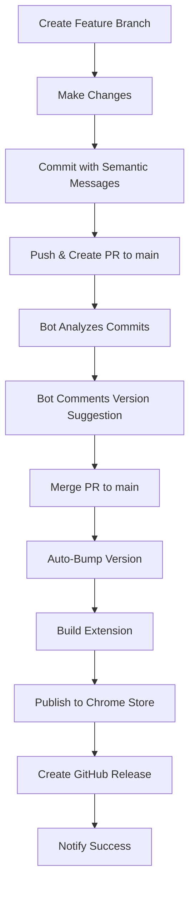

# 🚀 Robust Chrome Web Store Publishing - Quick Start

## 🎯 **What We Built**

A fully automated CI/CD pipeline that:
- ✅ **Auto-detects version bumps** from commit messages
- ✅ **Suggests versions on PRs** with intelligent analysis  
- ✅ **Auto-publishes on main merge** with zero manual intervention
- ✅ **Handles all version management** (package.json + manifest.json)
- ✅ **Creates GitHub releases** automatically
- ✅ **Publishes to Chrome Web Store** seamlessly

## ⚡ **Quick Usage**

### For Developers
```bash
# 1. Work on feature
git checkout -b feature/my-cool-feature
git commit -m "feat: add awesome new feature"
git push origin feature/my-cool-feature

# 2. Create PR to main
# → Bot analyzes commits and suggests version bump
# → Shows "1.0.5 → 1.1.0 (minor)" in PR comment

# 3. Merge PR
# → GitHub Actions auto-bumps version to 1.1.0
# → Builds and publishes to Chrome Web Store
# → Creates GitHub release
```

### For Release Managers
```bash
# Manual version bump if needed
npm run bump:major    # Breaking changes
npm run bump:minor    # New features  
npm run bump:patch    # Bug fixes

# Emergency manual deployment
# Go to GitHub Actions → "Production Deploy" → Run workflow
```

## 📋 **Commit Message Rules**

| Type | Version Bump | Examples |
|------|-------------|----------|
| **Major** | 1.0.0 → 2.0.0 | `BREAKING:`, `major:`, `Major:` |
| **Minor** | 1.0.0 → 1.1.0 | `feat:`, `feature:`, `minor:` |
| **Patch** | 1.0.0 → 1.0.1 | `fix:`, `docs:`, `refactor:`, etc. |

## 🔄 **Complete Workflow**



## 🛠 **Files Created**

1. **`.github/workflows/ci.yml`** - PR testing & version suggestion
2. **`.github/workflows/publish-chrome-extension.yml`** - Production deployment
3. **`scripts/bump-version.sh`** - Version management utility
4. **`docs/PUBLISHING.md`** - Complete documentation
5. **Updated `package.json`** - New scripts and version commands

## 🎉 **Benefits**

- **Zero Manual Work**: Push commits → Auto-publish to Chrome Store
- **Smart Versioning**: Commit messages drive version increments
- **Error Prevention**: Version consistency validation
- **Full Visibility**: PR comments show exactly what will happen
- **Emergency Controls**: Manual override capabilities
- **Audit Trail**: All versions tagged and documented

## 🚀 **Next Steps**

1. **Set up Chrome Web Store API** (one-time):
   ```bash
   npm run setup-webstore
   ```

2. **Add GitHub Secrets** (one-time):
   - `CHROME_EXTENSION_ID`
   - `CHROME_CLIENT_ID`
   - `CHROME_CLIENT_SECRET`
   - `CHROME_REFRESH_TOKEN`

3. **Start Using**:
   - Make commits with semantic messages
   - Create PRs to main
   - Watch the magic happen! ✨

Your Mark-It-CE extension now has enterprise-grade automated publishing! 🎯
